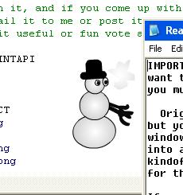



## Flash Desktop Mate

### Description

Flash Desktop Mate can put a transparent flash animation that wanders around your desktop interacting with windows. It's a fun little program I made for my kids last Christmas, but you can pretty easily change to your own animations if you want. It shows window interaction, flash-vb communication, form drag, window on top etc. Must have windows 2000 or XP as it uses layered windows. '98 users can comment out two lines in form_load to try it without transparency, read the readme for more info. You also have to have a recent flash ocx 6 or 7 to run.
 
### More Info
 

             |
---                |---
**Submitted On**   |2004-04-02 10:35:24
**By**             |[Apeiron](https://github.com/Planet-Source-Code/PSCIndex/blob/master/ByAuthor/apeiron.md)
**Level**          |Intermediate
**User Rating**    |4.9 (39 globes from 8 users)
**Compatibility**  |VB 5\.0, VB 6\.0
**Category**       |[Graphics](https://github.com/Planet-Source-Code/PSCIndex/blob/master/ByCategory/graphics__1-46.md)
**World**          |[Visual Basic](https://github.com/Planet-Source-Code/PSCIndex/blob/master/ByWorld/visual-basic.md)
**Archive File**   |[Flash\_Desk172758422004\.zip](https://github.com/Planet-Source-Code/apeiron-flash-desktop-mate__1-52812/archive/master.zip)

### API Declarations

Several

